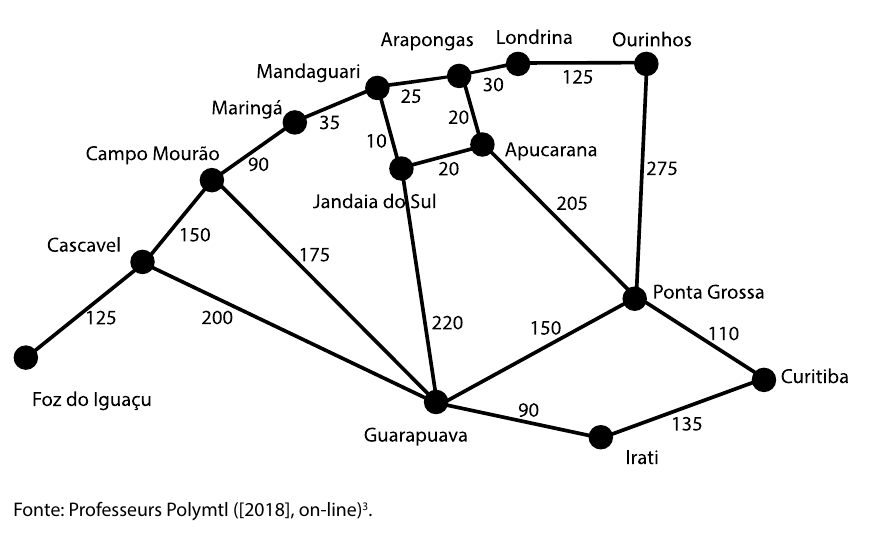

## Unidade 1 - Ponteiros

### 1. Faça um pequeno programa para testar seus conhecimentos sobre ponteiros e alocação dinâmica na memória.

a) Defina um ponteiro do tipo inteiro.  
b) Faça alocação dinâmica para o ponteiro recém-criado.  
c) Preencha a memória com o valor 42.  
d) Imprima o endereço do ponteiro na memória e o valor contido nele.  

### 2. Uma famosa fábrica de semáforos está testando um novo protótipo, menor, mais barato e eficiente. Foi solicitado à equipe de TI um programa em linguagem C para fazer o teste do novo hardware. O semáforo tem três objetos, cada um contém um atributo cor e outro id. Devido às limitações de memória e processamento, é necessária a criação de um ponteiro que vai percorrendo a memória e imprimindo o valor na tela.

a) Crie uma estrutura que tenha dois atributos: cor (cadeia de caracteres) e id
(inteiro).  
b) Crie três variáveis com o tipo definido no item a.  
c) Crie um ponteiro do mesmo tipo. 

d) Inicialize as estruturas da seguinte forma:  
• cor vermelha, id 1.  
• cor amarela, id 2.  
• cor verde, id 3.  

e) Inicialize o ponteiro apontando para a primeira variável criada.   

f ) Por meio de operações aritméticas com ponteiros, percorra a memória e imprima o valor de cada uma das variáveis criadas nesse programa.  

### 3. Qual a diferença entre uma variável do tipo inteira de um ponteiro do tipo in-
teiro?

### 4. Por que devemos preencher um ponteiro apenas com o endereço de uma variá-
vel ou por alocação dinâmica usando funções como malloc?

### 5. Crie um programa que leia uma variável e crie dois vetores dinâmicos, um com
o tamanho lido e outro com o dobro desse tamanho. Preencha esses vetores
respectivamente com potências de 2 e potências de 3.
a) Crie uma variável inteira e dois ponteiros do tipo inteiro.
b) Pergunte ao usuário o tamanho do vetor dinâmico e leia esse valor na variável
inteira.
c) Aloque dinamicamente os dois vetores usando a função malloc.
d) Faça um laço de repetição para preencher o primeiro vetor com potências
de 2.
e) Faça um segundo laço de repetição para preencher o outro vetor com po-
tências de 3.
f ) Não se esqueça de usar a biblioteca math.h para poder usar o cálculo de
potência (pow).

### Observações:

* Este código demonstra conceitos básicos de ponteiros e alocação dinâmica em C.
* Em cenários reais, a gestão de memória e o tratamento de erros devem ser mais robustos.
* O código pode ser adaptado para diferentes tipos de dados e tarefas.

### Lembre-se:

* A prática é fundamental para dominar os conceitos de ponteiros e alocação dinâmica.
* Existem diversos recursos online e tutoriais disponíveis para auxiliar no aprendizado.
* Utilize ferramentas de depuração para identificar e corrigir erros no código.

## Unidade 2 - Pilhas e Filas

### 1. Quando um livro é devolvido na Biblioteca do Unicesumar, o funcionário responsável pelo recebimento coloca o livro em cima de uma pilha de livros na mesa ao lado da recepção. O auxiliar de bibliotecário pega o livro do topo da pilha, verifica o seu código e leva-o para o seu devido local no acervo. No atual sistema de informação, é possível verificar se o livro está disponível ou se está emprestado. Entretanto, o livro que acabou de ser devolvido ainda não se encontra na prateleira, pois existe um intervalo de tempo entre a devolução do mesmo e o momento em que ele é guardado na estante. A sugestão do departamento de TI é de criar um programa que faça o controle na pilha, assim, pode-se verificar se o livro ainda não foi guardado e qual a sua posição dentro da pilha de livros que aguardam ao lado da recepção.

a) Crie uma estrutura para a pilha de livros. Lembre-se de que ela tem que ter um vetor para armazenar os dados (código, nome do livro e autor) e dois números inteiros, um para controlar o início e outro o final da pilha.  
b) Defina a variável que será um vetor do tipo pilha de livros.  
c) Faça uma função de empilhamento, lembrando-se de verificar se a pilha atingiu o tamanho máximo de livros (a mesa não aguenta muito peso).  
d) Crie uma função para desempilhamento de livros. Não se esqueça de que é necessário verificar se ainda existem livros para ser guardados.  
e) Elabore uma função que apresente na tela a lista de todos os livros que se encontram empilhados ao lado da recepção.

### 2. Uma agência bancária quer inovar seu atendimento, criando mais conforto para seus clientes. Para isso, foram colocadas diversas cadeiras na recepção do banco. Quando um cliente chega, o atendente lança no computador o seu nome e o horário que chegou. Assim que um caixa fica livre, a recepcionista olha no sistema e chama o primeiro cliente da fila. Dessa forma, é possível que os clientes esperem confortavelmente sentados pelo seu atendimento, não importando o local onde se encontrem dentro da agência bancária.

a) Faça uma estrutura para o controle da fila. Você precisa guardar o nome e a hora que o cliente chegou. Use um vetor para armazenar os dados e dois números inteiros, um para controlar o início e outro o final da fila.  
b) Defina a variável que será um vetor do tipo fila de clientes.  
c) Crie uma função enfileirar, lembrando que é preciso verificar se há espaço na fila (o número de cadeiras na recepção é limitado).  
d) Elabore a função desenfileirar cliente, não se esqueça de que é necessário verificar se ainda existem clientes para serem atendidos.  
e) Faça uma função que apresente na tela a lista de todos os clientes que estão aguardando atendimento na recepção.

### Observações:

- Este código demonstra conceitos básicos de pilhas e filas em C.
- Em cenários reais, a gestão de dados e o tratamento de erros devem ser mais robustos.
- O código pode ser adaptado para diferentes tipos de dados e tarefas.

### Lembre-se:

- A prática é fundamental para dominar os conceitos de pilhas e filas.
- Existem diversos recursos online e tutoriais disponíveis para auxiliar no aprendizado.
- Utilize ferramentas de depuração para identificar e corrigir erros no código.

## Unidade 3 - Listas dinâmicas

### 1. É possível criar uma lista de forma estática usando um vetor?

### 2. Crie a estrutura de um nó para uma lista encadeada.

### 3. Crie a estrutura de um nó para uma lista duplamente encadeada.

### 4. Qual a vantagem de uma lista duplamente encadeada em relação a uma lista simples?

### 5. Como sabemos qual é o nó inicial de uma lista simples?

### 6. Como sabemos qual é o nó final de uma lista simples?

### 7. Se o nó de uma lista duplamente encadeada possui dois ponteiros, um para o próximo elemento e um para o anterior, qual informação está contida nesses ponteiros do primeiro nó da lista?

### Observações:

- Listas dinâmicas permitem um uso mais eficiente da memória, ajustando-se conforme a necessidade.
- Estruturas como listas encadeadas e duplamente encadeadas são fundamentais para a compreensão de algoritmos mais complexos.
- Praticar a implementação dessas listas ajuda a entender melhor a manipulação de ponteiros e a alocação dinâmica.

### Lembre-se:

- A prática é essencial para dominar os conceitos de listas dinâmicas.
- Existem muitos recursos online e tutoriais disponíveis para auxiliar no aprendizado.
- Utilize ferramentas de depuração para identificar e corrigir erros no código.
- Compreender listas dinâmicas é um passo importante para se aprofundar em estruturas de dados mais avançadas.
- Aprofundar-se em listas dinâmicas melhora a eficiência na resolução de problemas e no desenvolvimento de software.

## Unidade 4 - Grafos

Dados os seguintes conjuntos G = (V,E):

a) V= {a}, E= {∅}

b) V= {a,b}, E= {(a,b)}

c) V= {a,b}, E= {<b,a>}

d) V= {a,b,c}, E= {(a,b), (b,c)}

e) V= {a,b,c}, E= {<a,b>, <c,b>, <a,c>, <c,a>}

f ) V= {a,b,c,d}, E= {<a,b>, <d,a>}

g) V= {a,b,c,d}, E= {(a,b), (a,c), (a,d)}

### 1. Desenhe a representação em Grafo de cada conjunto G = (V,E).

### 2. Classifique cada um dos conjuntos G = (V,E) como sendo orientado, não orientado, conexo e desconexo.

### 3. Crie a matriz de adjacência para cada conjunto G = (V,E).

### Observações:

- A compreensão de grafos é crucial em áreas como ciência da computação, redes, e matemática aplicada.
- Grafos são representações poderosas para modelar problemas complexos de forma visual e estruturada.

### Lembre-se:

- A prática na construção e análise de grafos fortalece habilidades analíticas e de resolução de problemas.
- Recursos como software especializado e bibliotecas podem auxiliar na visualização e manipulação de grafos.
- Entender as propriedades dos grafos ajuda na aplicação de algoritmos para solução de problemas do mundo real.

## Unidade 5 - Busca em Grafos

### 1. Qual é a principal diferença entre a Busca em Largura e a Busca em Profundidade?

### 2. Em que caso a Busca em Largura é mais eficiente que a Busca em Profundidade?

### 3. O que diferencia o algoritmo de Dijkstra e a busca em largura?

### 4. Digite no seu computador o Programa 5.4. Entre com o Grafo (ou parte dele) a seguir e faça simulações de busca de caminho mais curto entre duas cidades.

### Observações:

- Compreender as diferenças entre algoritmos de busca é fundamental para escolher o mais adequado para um problema específico.
- A aplicação de algoritmos como Dijkstra e busca em largura é comum em sistemas de navegação, redes e otimização.
- A visualização e simulação de grafos auxiliam na compreensão prática do comportamento desses algoritmos.

### Lembre-se:

- A eficiência na escolha do algoritmo de busca depende das características do problema e da estrutura do grafo.
- Pratique a implementação e simulação de algoritmos de busca para consolidar o entendimento teórico.
- Utilize ferramentas de visualização de grafos para acompanhar o processo de busca e otimização.
